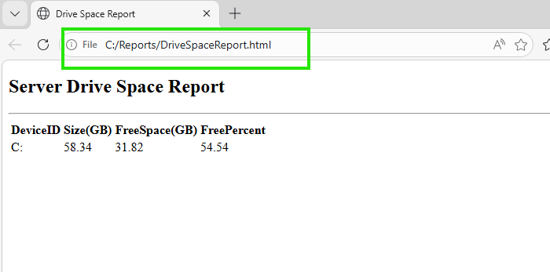
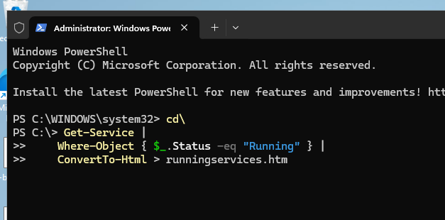
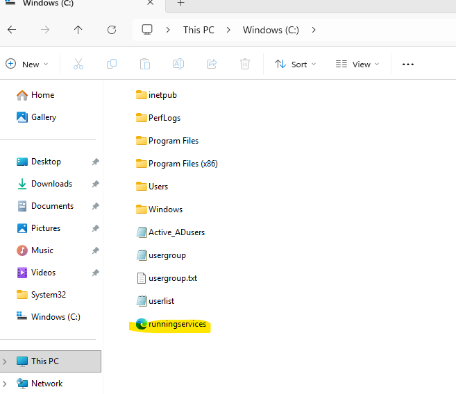
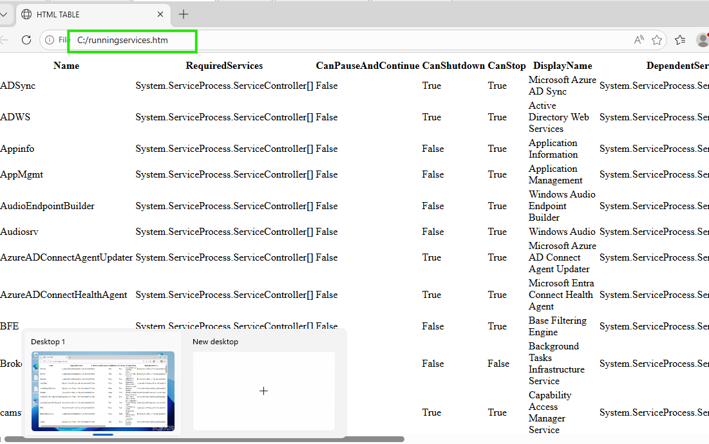
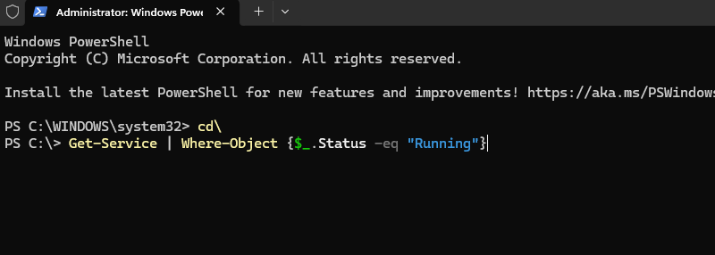
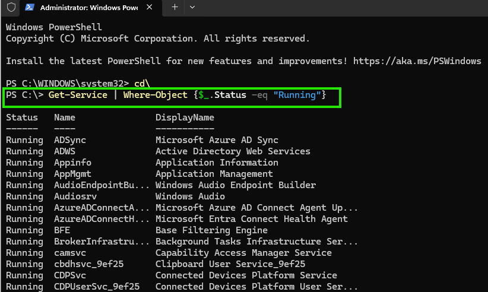
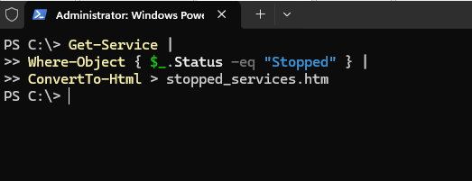
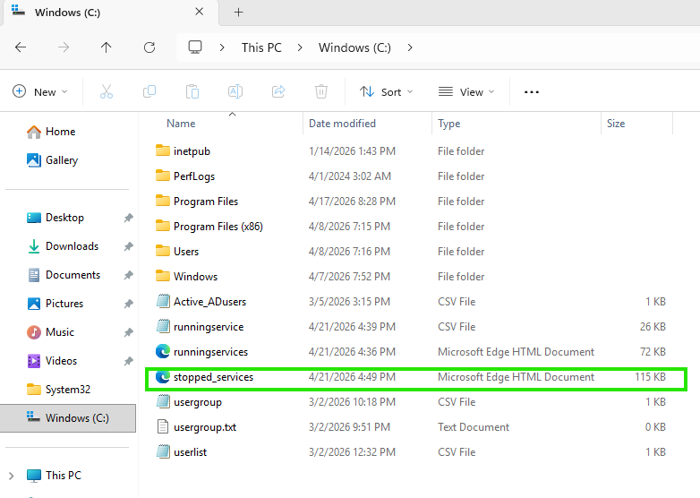
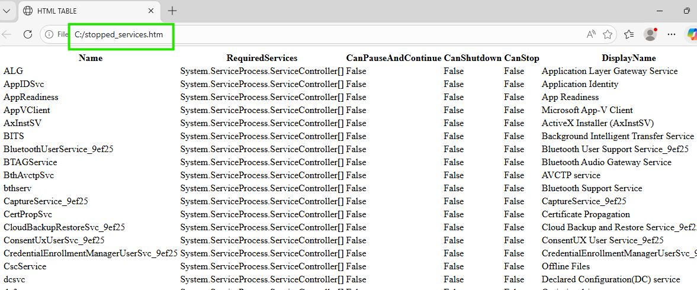
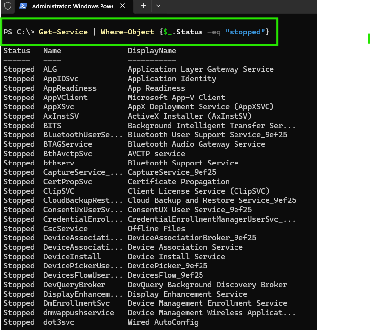

# Powershell Scripts for Monitoring Services
1) Check Drive Space
2) Check Services running

## 1st Script: Check Drive Space via PS1 script on PS ISE and create an HTML file

## 2nd Script: Check Server Services and convert to HTML

