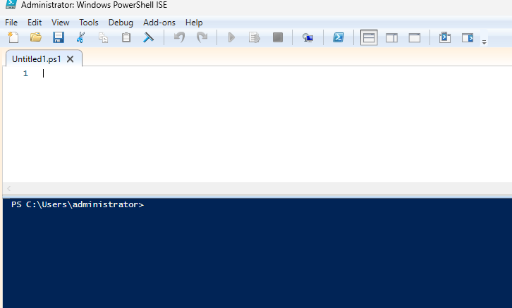
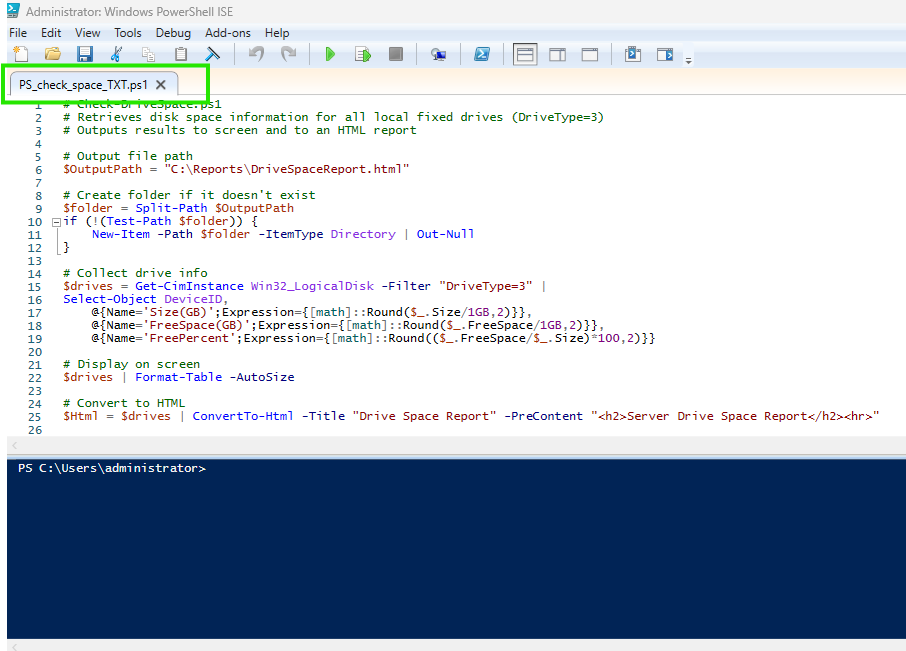
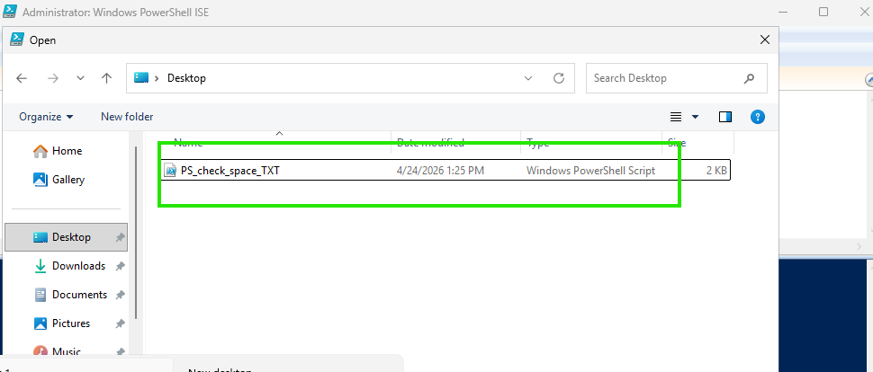
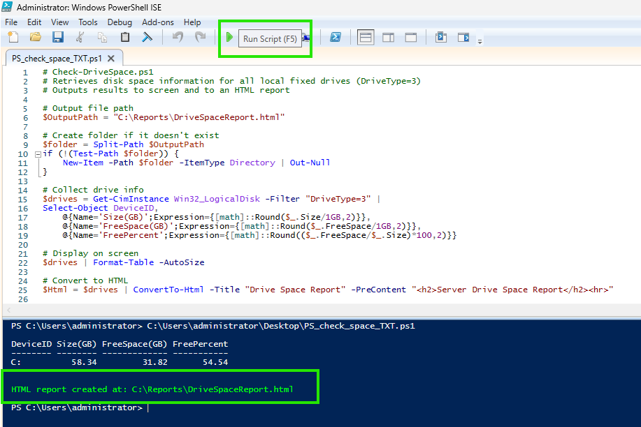
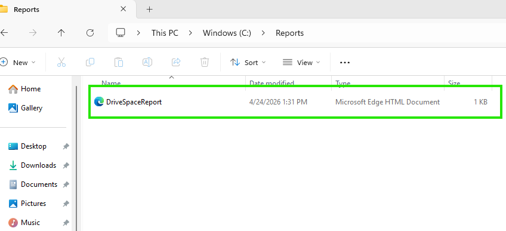

## Powershell Scripts for Monitoring Services

### 1st Script: Check Drive Space via PS1 script on PS ISE and create an HTML file

### Usage Instructions: How to run the .ps1 file.

### Features: Bullet points of what it does.

### 2nd Script: Check Drive Space via PS1 script on PS ISE and create an HTML file

